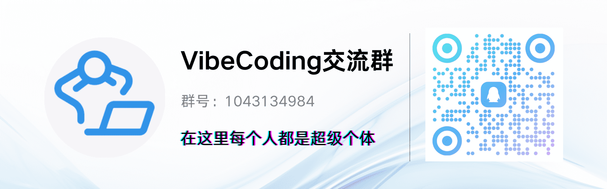

<div align="center">


简洁通用的群体智能引擎，预测万物
</br>
<em>A Simple and Universal Swarm Intelligence Engine, Predicting Anything</em>

<a href="https://www.shanda.com/" target="_blank"></a>

[](https://github.com/666ghj/MiroFish/stargazers)
[](https://github.com/666ghj/MiroFish/watchers)
[](https://github.com/666ghj/MiroFish/network)
[](https://github.com/666ghj/MiroFish/issues)
[](https://github.com/666ghj/MiroFish/pulls)

[](https://github.com/666ghj/MiroFish/blob/main/LICENSE)
[](https://deepwiki.com/666ghj/MiroFish)
[](https://hub.docker.com/)
[](https://github.com/666ghj/MiroFish)

[English](./README-EN.md) | [中文文档](./README.md)

</div>

## ⚡ 项目概述

**MiroFish** 是一款基于多智能体技术的新一代 AI 预测引擎。通过提取现实世界的种子信息（如突发新闻、政策草案、金融信号），自动构建出高保真的平行数字世界。在此空间内，成千上万个具备独立人格、长期记忆与行为逻辑的智能体进行自由交互与社会演化。你可透过「上帝视角」动态注入变量，精准推演未来走向——**让未来在数字沙盘中预演，助决策在百战模拟后胜出**。

> 你只需：上传种子材料（数据分析报告或者有趣的小说故事），并用自然语言描述预测需求</br>
> MiroFish 将返回：一份详尽的预测报告，以及一个可深度交互的高保真数字世界

### 我们的愿景

MiroFish 致力于打造映射现实的群体智能镜像，通过捕捉个体互动引发的群体涌现，突破传统预测的局限：

- **于宏观**：我们是决策者的预演实验室，让政策与公关在零风险中试错
- **于微观**：我们是个人用户的创意沙盘，无论是推演小说结局还是探索脑洞，皆可有趣、好玩、触手可及

从严肃预测到趣味仿真，我们让每一个如果都能看见结果，让预测万物成为可能。

## 📸 系统截图

<div align="center">
<table>
<tr>
<td></td>
<td></td>
</tr>
<tr>
<td></td>
<td></td>
</tr>
<tr>
<td></td>
<td></td>
</tr>
</table>
</div>

## 🎬 演示视频

### 1. 武汉大学舆情推演预测 + MiroFish项目讲解

<div align="center">
<a href="https://www.bilibili.com/video/BV1VYBsBHEMY/" target="_blank"></a>

点击图片查看使用微舆BettaFish生成的《武大舆情报告》进行预测的完整演示视频
</div>

### 2. 《红楼梦》失传结局推演预测

<div align="center">
<a href="https://www.bilibili.com/video/BV1cPk3BBExq" target="_blank"></a>

点击图片查看基于《红楼梦》前80回数十万字，MiroFish深度预测失传结局
</div>

> **金融方向推演预测**、**时政要闻推演预测**等示例陆续更新中...

## 🔄 工作流程

1. **图谱构建**：现实种子提取 & 个体与群体记忆注入 & GraphRAG构建（本地模式使用 Neo4j + Qdrant）
2. **环境搭建**：实体关系抽取 & 人设生成 & 环境配置Agent注入仿真参数
3. **开始模拟**：双平台并行模拟 & 自动解析预测需求 & 动态更新时序记忆
4. **报告生成**：ReportAgent拥有丰富的工具集与模拟后环境进行深度交互
5. **深度互动**：与模拟世界中的任意一位进行对话 & 与ReportAgent进行对话

## 🚀 快速开始

### 一、源码部署（推荐）

#### 前置要求

| 工具 | 版本要求 | 说明 | 安装检查 |
|------|---------|------|---------|
| **Node.js** | 18+ | 前端运行环境，包含 npm | `node -v` |
| **Python** | ≥3.11, ≤3.12 | 后端运行环境 | `python --version` |
| **uv** | 最新版 | Python 包管理器 | `uv --version` |

#### 1. 配置环境变量

```bash
# 复制示例配置文件
cp .env.example .env

# 编辑 .env 文件，填入必要的 API 密钥
```

**必需的环境变量：**

```env
# LLM API配置（支持 OpenAI SDK 格式的任意 LLM API）
# 推荐使用阿里百炼平台qwen-plus模型：https://bailian.console.aliyun.com/
# 注意消耗较大，可先进行小于40轮的模拟尝试
LLM_API_KEY=your_api_key
LLM_BASE_URL=https://dashscope.aliyuncs.com/compatible-mode/v1
LLM_MODEL_NAME=qwen-plus

# 图谱记忆配置（二选一）
# 方案A：本地模式（推荐，完全免费，使用 Neo4j + Qdrant）
ZEP_USE_LOCAL=true
NEO4J_PASSWORD=your_neo4j_password  # 自定义 Neo4j 密码
EMBEDDING_USE_LOCAL=true            # 使用本地 embedding 模型

# 方案B：云端模式（使用 Zep Cloud，需要注册）
ZEP_API_KEY=your_zep_api_key
```

#### 2. 安装依赖

```bash
# 一键安装所有依赖（根目录 + 前端 + 后端）
npm run setup:all
```

或者分步安装：

```bash
# 安装 Node 依赖（根目录 + 前端）
npm run setup

# 安装 Python 依赖（后端，自动创建虚拟环境）
npm run setup:backend
```

#### 3. 启动服务

```bash
# 同时启动前后端（在项目根目录执行）
npm run dev
```

**服务地址：**
- 前端：`http://localhost:3000`
- 后端 API：`http://localhost:5001`

**单独启动：**

```bash
npm run backend   # 仅启动后端
npm run frontend  # 仅启动前端
```

### 二、Docker 部署（推荐本地模式）

```bash
# 1. 配置环境变量
cp .env.example .env
# 编辑 .env，设置 ZEP_USE_LOCAL=true 和 NEO4J_PASSWORD

# 2. 启动所有服务（包括 Neo4j + Qdrant）
docker compose up -d
```

**服务说明：**
| 服务 | 端口 | 说明 |
|------|------|------|
| mirofish | 3001/5001 | 主应用（前端/后端） |
| neo4j | 7474/7687 | 图数据库（Web界面/Bolt协议） |
| qdrant | 6333/6334 | 向量数据库（HTTP/gRPC） |

> 在 `docker-compose.yml` 中已通过注释提供加速镜像地址，可按需替换

### 三、本地模式说明

MiroFish 支持两种图谱记忆模式：

#### 本地模式（推荐）
- **完全免费**：使用 Neo4j（图数据库）+ Qdrant（向量数据库）
- **数据私有**：所有数据存储在本地，不上传云端
- **离线运行**：支持离线 embedding 模型，无需联网
- **一键启动**：Docker Compose 自动拉起所有依赖服务

```env
ZEP_USE_LOCAL=true
NEO4J_PASSWORD=your_password
EMBEDDING_USE_LOCAL=true
```

#### 云端模式
- **开箱即用**：使用 Zep Cloud 服务，无需本地数据库
- **免费额度**：每月有限额，适合轻度使用
- **需要注册**：需在 https://app.getzep.com/ 注册获取 API Key

```env
ZEP_USE_LOCAL=false
ZEP_API_KEY=your_zep_api_key
```

## 📬 更多交流

<div align="center">

</div>

&nbsp;

MiroFish团队长期招募全职/实习，如果你对多Agent应用感兴趣，欢迎投递简历至：**mirofish@shanda.com**

## 📄 致谢

**MiroFish 得到了盛大集团的战略支持和孵化！**

MiroFish 的仿真引擎由 **[OASIS](https://github.com/camel-ai/oasis)** 驱动，我们衷心感谢 CAMEL-AI 团队的开源贡献！

## 📈 项目统计

<a href="https://www.star-history.com/#666ghj/MiroFish&type=date&legend=top-left">
 <picture>
   <source media="(prefers-color-scheme: dark)" srcset="https://api.star-history.com/svg?repos=666ghj/MiroFish&type=date&theme=dark&legend=top-left" />
   <source media="(prefers-color-scheme: light)" srcset="https://api.star-history.com/svg?repos=666ghj/MiroFish&type=date&legend=top-left" />
   
 </picture>
</a>
